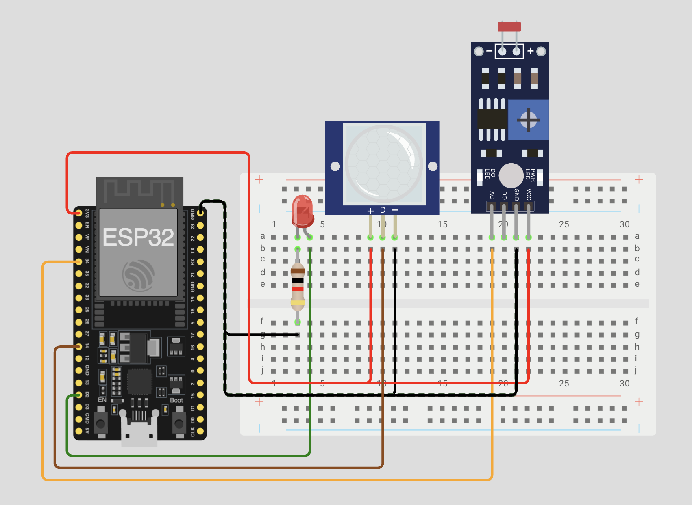
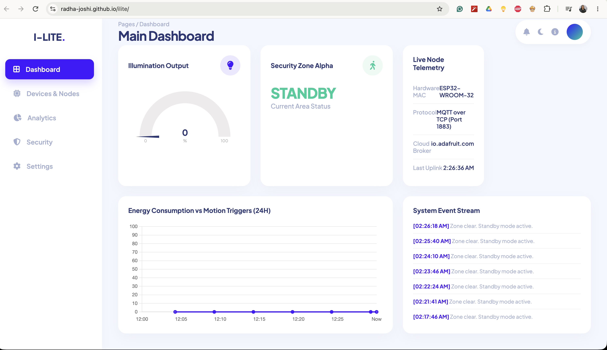
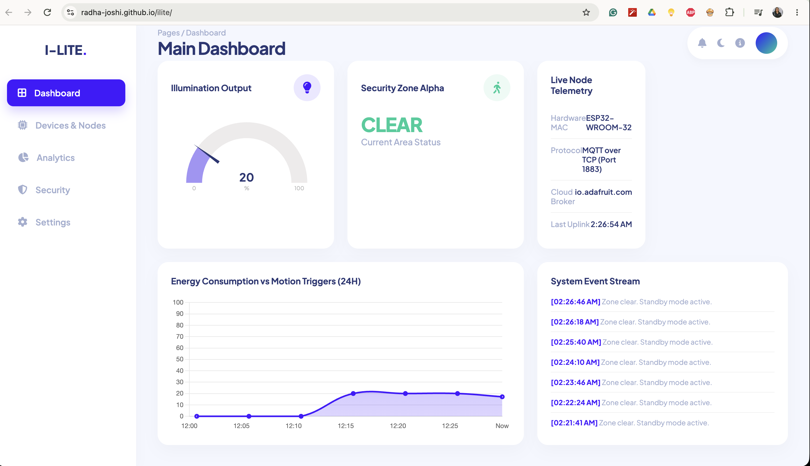
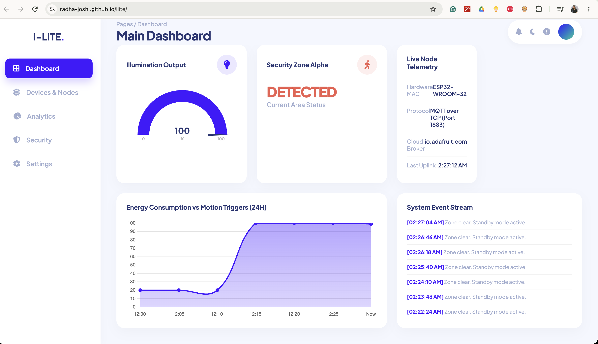

# I-LITE: Intelligent Lighting Integration for Traffic & Environment

A web-based dashboard for real-time monitoring of an IoT smart lighting and security system.

# Working and Implementation

- **Hardware Simulation:** ESP32, PIR Motion Sensor, LDR, LED (via Wokwi)
- **Backend Routing:** Adafruit IO (MQTT Broker)
- **Frontend UI:** HTML, CSS, JavaScript, Chart.js (Hosted on GitHub Pages)

# Live Links

- **Live Dashboard:** [Link to your GitHub Pages URL]
- **Hardware Simulation:** [Link to your Wokwi project]

# Project Screenshots

- Wokwi Circuit

- Standby Dashboard

- Active Dashboard

- Detected Dashboard

